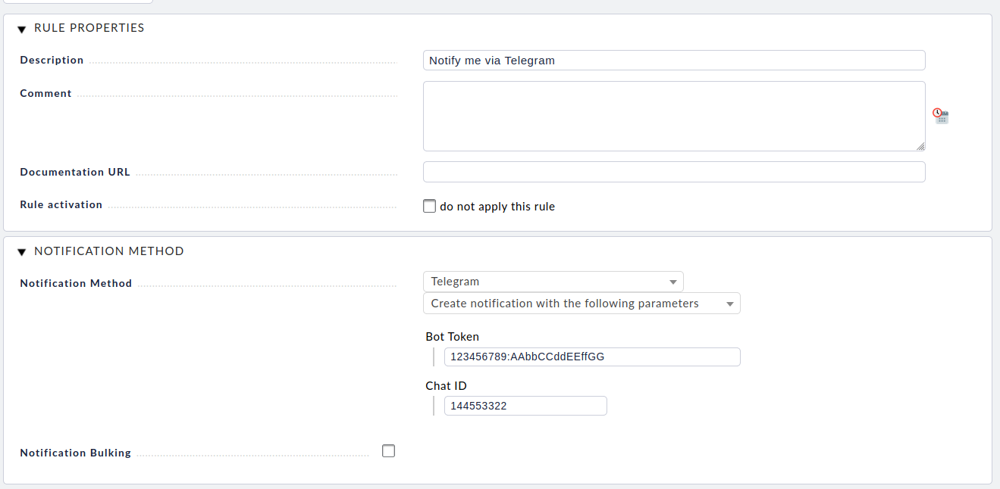

<!--
# SPDX-FileCopyrightText: 2021 Stefan Gehn <stefan+cmk@srcbox.net>
#
# SPDX-License-Identifier: CC0-1.0
-->

# Forked from PR <https://git.srcbox.net/stefan/checkmk_telegram_notifications/pulls/4>

Changes:
- Escape characters ``-`` => ``\-`` <https://core.telegram.org/bots/api#markdownv2-style>

# Checkmk Telegram Notifications

This is a Checkmk plugin to send notifications via Telegram.

The initial version of this plugin was posted in 2016 on my blog:
[Monitoring Notifications via Telegram](https://www.srcbox.net/posts/monitoring-notifications-via-telegram/)


## Download

The latest version can always be found under
[Releases](https://git.srcbox.net/stefan/checkmk_telegram_notifications/releases).

The plugin is also available at
[Checkmk Exchange](https://exchange.checkmk.com/p/telegram-notifications) but
it may take some time to see new releases.


## Setup

Sending messages via a Telegram bot requires two pieces of information:
1. The `token`  of a Telegram Bot to send messages with
2. The `chat id` for any user to send notifications to


## Telegram Bot

The instructions for talking to
[BotFather](https://core.telegram.org/bots#6-botfather) (the Telegram bot used
to create a new bot) should be straightforward to follow. The resulting `token`
will be needed for all following steps.

To send messages to a Telegram user, one needs to know the internal `chat id`
for the chat/conversation between the user and the bot.

To find out the `chat id`, open a private conversation with the bot and send
at least one message. Afterwards query the list of incoming messages via the
`getUpdates` function of the Telegram Bot API by fetching
`https://api.telegram.org/botTOKEN/getUpdates` (replacing `TOKEN` with the
actual bot token).

For example using `curl` and `jq` (opening the URL in a web browser will work
as well):
```bash
curl --silent "https://api.telegram.org/bot${TOKEN}/getUpdates" | jq '.result[].message.chat'
```

Output:
```json
"chat": {
    "id": 144553322,
    "first_name": "Stefan",
    "type": "private"
}
```

In the above example the `chat id` would be `144553322`.


## Notification


With both the bot `token` as well as the `chat id` being known one can now
create a notification rule in Checkmk.


